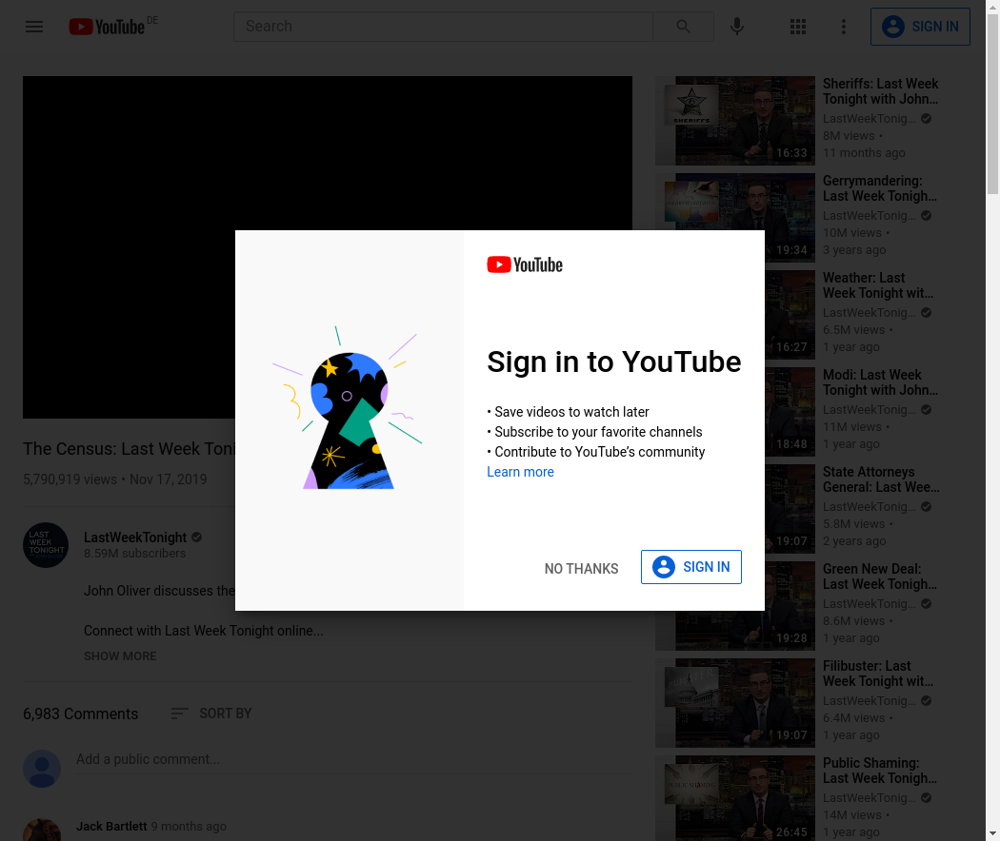
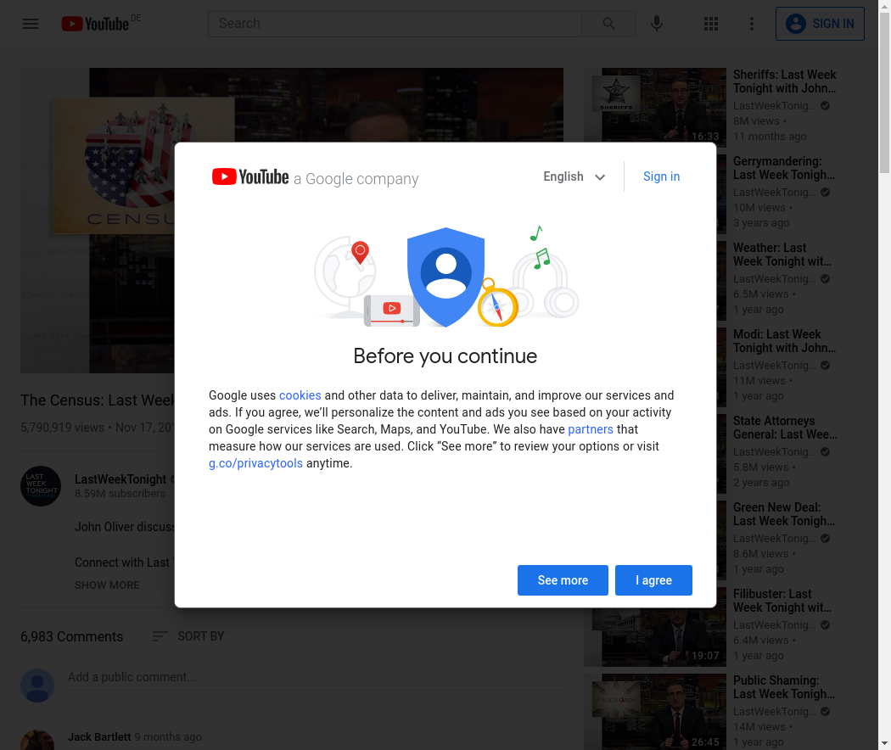

```{r setup, include = F}
if (!require(easypackages)) install.packages("easypackages")
library(easypackages)

packages("hadley/emo",
         "gadenbuie/xaringanExtra",
         "knitr",
         "rmarkdown",
         "xml2",
         prompt = F)

options(htmltools.dir.version = FALSE,
        htmltools.preserve.raw = FALSE)

#opts_chunk$set(eval = F)

xaringanExtra::use_xaringan_extra(c("tile_view", "clipboard"))
xaringanExtra::use_extra_styles(hover_code_line = TRUE,
                                mute_unhighlighted_code = FALSE)
```


# Screenscraping

There are two packages for screenscraping in `R`
  - [`rvest`](https://github.com/tidyverse/rvest): Sufficient for scraping **static** websites
  - [`RSelenium`](https://github.com/ropensci/RSelenium): Can also deal with **dynamic** websites

Dynamic websites are pages that _dynamically_ load content from the database without
changing the URL

Example: When you got to a _YouTube_ video while not being logged in, a pop-up will prompt you
to log in with your Google account. You can not access any if the page information
before you haven't closed this window. Setups like this usually load dynamic content with [Ajax](https://en.wikipedia.org/wiki/Ajax_(programming)).

---
# Screenscraping with `rvest`

```{r collapse = TRUE, results='hide'}
# installing and loading the package
if ("rvest" %in% installed.packages() != TRUE) {
  install.packages("rvest")};library(rvest)

# defining website and XPath from inspect function in browser
page <- "https://en.wikipedia.org/wiki/List_of_most-viewed_YouTube_videos"
Xp <- "/html/body/div[3]/div[3]/div[5]/div[1]/table[3]/tbody" 

# getting page
Website <- read_html(page)

# getting node containing the table
Description <- html_nodes(Website, xpath = Xp)

# printing info table
info <- as.data.frame(html_table(Description, header = TRUE, fill = TRUE))[c(-1),]
```

---
# Screenscraping with `RSelenium`

```{r}
# We first have to configure Docker and open a Docker container:
# https://cran.r-project.org/web/packages/RSelenium/vignettes/docker.html

# installing package
if ("RSelenium" %in% installed.packages() != TRUE) {
  install.packages("RSelenium")
}

# loading package
library(RSelenium)

# opening Docker container from system
check <- system2("docker", args = "ps", stdout = TRUE)

```

---
# Screenscraping with `RSelenium`

```{r}

# opening new Docker container (and killing old ones)
if (length(check) == 1) {
  
  #start new container
  system2("docker", args = c("run",
                             "-d",
                             "-p",
                             "4445:4444",
                             "selenium/standalone-chrome"))
  
} else {
  
  # kill old container
  DockerName <- trimws(strsplit(check[2],"tcp")[[1]][3])
  system2("docker", args = c("kill",DockerName))
  
  # start new container
  system2("docker", args = c("run",
                             "-d",
                             "-p",
                             "4445:4444",
                             "selenium/standalone-chrome"))
  
}

```
---
# Screenscraping with `RSelenium`

```{r}
# Assigning Google Chrome Docker session
remDr <- RSelenium::remoteDriver(remoteServerAddr = "localhost",
                                 port = 4445L,
                                 browserName = "chrome")

# Waiting for 5 seconds to finish initialization of Docker session
Sys.sleep(5)

```

---
# Screenscraping with `RSelenium`

- We can now navigate to a website and print a screenshot

```{r, results = 'hide'}

# assigning IP
remDr <- remoteDriver(remoteServerAddr = "193.197.93.156", port = 4445L) 

# Open remote connection
remDr$open()

# Navigate to website
remDr$navigate("https://www.youtube.com/watch?v=1aheRpmurAo&")

# Wait for 2 seconds for the website to load
Sys.sleep(2)

# Scroll down a bit
#webElem <- remDr$findElement("css", "body")

#for (i in 20){
#  webElem$sendKeysToElement(list(key = "down_arrow"))
#}

# Take screenshot
remDr$screenshot(file = 'Images/RSeleniumScreenshot.png')
```
---
# Screenshot 


---
# Screenscraping with `RSelenium`
 - We can then navigate to the "no thanks" button, and click it
 
```{r, results = 'hide'}

# Xpath of "show more" button (using inspect element in browser)
id <- 'dismiss-button'

# navigating to button element
element <- remDr$findElement(using = 'id', id)

# click on button
element$clickElement()

# take screenshot (we can see that we get another Goolge cookie popup)
remDr$screenshot(file = 'Images/RSeleniumScreenshot2.png')

```

---
# Screenscraping with `RSelenium`

- We need to click the "I agree" button to get rid of the popup

```{r, results = 'hide'}


######## CONTINUE NEW SCRIPT HERE!

```
---
# Screenshot 



---
# Screenscraping with `RSelenium`

- We can now extract the contents of the expanded description box

```{r, results = 'hide'}

# navigate to description element
xp2 <- '//*[@id="description"]/yt-formatted-string'
element2 <- remDr$findElement(using = 'xpath', xp2)

# get element text
unlist(element2$getElementText())

```

"John Oliver discusses the census, why it matters, and the consequences of an undercount.\n\nConnect with Last Week Tonight online... \n\nSubscribe to the Last Week Tonight YouTube channel for more almost news as it almost happens: www.youtube.com/lastweektonight \n\nFind Last Week Tonight on Facebook like your mom would: www.facebook.com/lastweektonight \n\nFollow us on Twitter for news about jokes and jokes about news: www.twitter.com/lastweektonight \n\nVisit our official site for all that other stuff at once: www.hbo.com/lastweektonight"

---
class: center, middle

# [Exercise](https://jobreu.github.io/youtube-workshop-gesis-2020/exercises/A2_Excursus_Screenscraping_question.html) time `r ji("weight_lifting_woman")``r ji("muscle")``r ji("running_man")``r ji("biking_man")`

## [Solutions](https://jobreu.github.io/youtube-workshop-gesis-2020/solutions/A2_Excursus_Screenscraping_solution.html)
