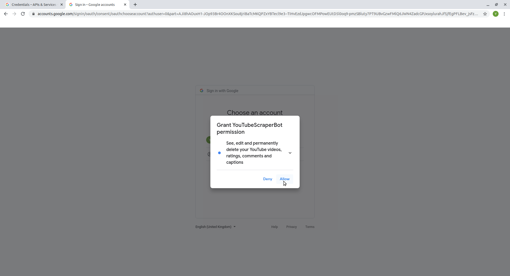
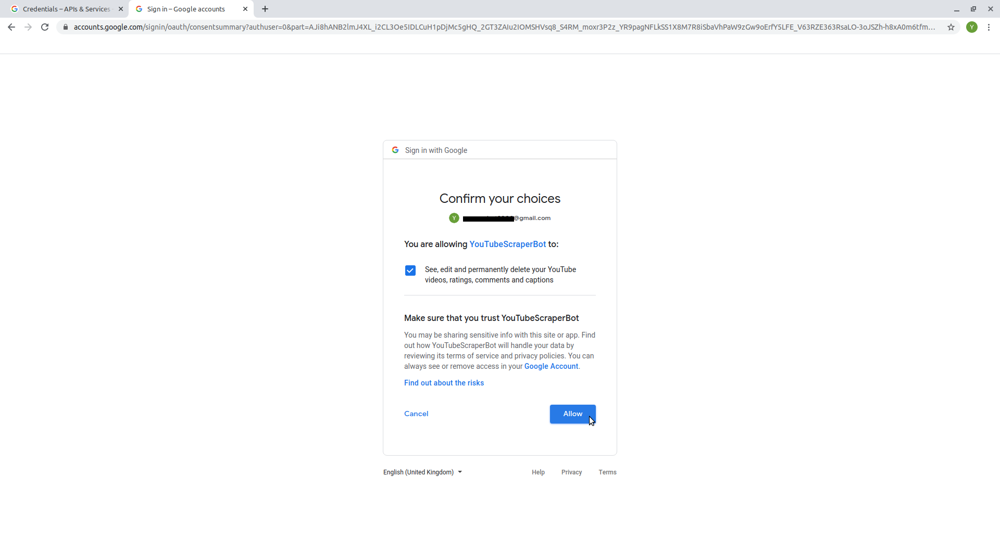

layout: true

```{r setup, include = F}
if (!require(easypackages)) install.packages("easypackages")
library(easypackages)

packages("knitr",
         "rmarkdown",
         "tidyverse",
         "kableExtra",
         "hadley/emo",
         "tuber",
         "keyring",
         "vosonSML",
         "gadenbuie/xaringanExtra",
         "gadenbuie/tweetrmd",
         prompt = F)

options(htmltools.dir.version = FALSE,
        htmltools.preserve.raw = FALSE)

opts_chunk$set(echo = TRUE,
               fig.align = "center")


xaringanExtra::use_xaringan_extra(c("tile_view", "clipboard"))
xaringanExtra::use_extra_styles(hover_code_line = TRUE,
                                mute_unhighlighted_code = FALSE)
```

<div class="my-footer">
  <div style="float: left;"><span>`r gsub("<br />", ", ", gsub("<br /><br />|<a.+$", "", metadata$author))`</span></div>
  <div style="float: right;"><span>`r metadata$location`, `r metadata$date`</span></div>
  <div style="text-align: center;"><span>`r gsub(".+<br />", " ", metadata$subtitle)`</span></div>
</div>

---

## Collecting *YouTube* Data with `R`

As stated in the Introduction, there are several packages for collecting *YouTube* data in `R`: [`tuber`](https://cran.r-project.org/web/packages/tuber/), [`vosonSML`](https://cran.r-project.org/web/packages/vosonSML/), [`VOSONDash`](https://vosonlab.github.io/VOSONDash/), and [`youtubecaption`](https://cran.r-project.org/web/packages/youtubecaption/).

In this session, we will focus on working with the `tuber` package. While `vosonSML` and `VOSONDash` are very powerful for generating (and analyzing) network data (and can also collect more comments per video as we will see later), `tuber` offers functions for collecting different types of data about channels, playlists, and videos.

---

## The `tuber` Package

With the [`tuber` package](https://github.com/soodoku/tuber) you can access the *YouTube* API via `R`. The author of the package has written a short [vignette](https://cran.r-project.org/web/packages/tuber/vignettes/tuber-ex.html) to introduce some of its main functions.

*Note*: You can also access/open this vignette in `R`/*RStudio* with the following command:
```{r tuber-vignette, eval = F}
vignette("tuber-ex")
```

--

Essentially, there are three main units of analysis for which you can access data with the `tuber` package:

1. Videos
1. Channels
1. Playlists

In this workshop, we will focus on accessing and working with data for individual **videos**.

---

## Setup

```{r packages, eval = F}
remotes::install_github("soodoku/tuber", build_vignettes = TRUE)
# this installs the development version of tuber from GitHub
install.packages("tidyverse")
library(tuber)
library(tidyverse)
```

**NB**: If your version of `R` is < 4.0.0, you should also run the following command before collecting data from the *YouTube* API:

```{r options, eval = F}
options(stringsAsFactors = FALSE)
```

---

## Excursus: Keep Your Secrets Secret

If you save your API credentials in an `R` script, anyone who has that script can potentially use your API key. This can affect your quota and might even cause costs for you (if you have billing enabled for your project).

*Sidenote*: If you use [environment variables](https://stat.ethz.ch/R-manual/R-devel/library/base/html/EnvVar.html) in `R` and store your app ID and secret there, your credentials won't be shared if you share your scripts. However, the information is still stored locally in a plain text file. You can run `usethis::edit_r_environ()` to see its contents.

---

## Excursus: Keep Your Secrets Secret

```{r tweet-secret, echo = F}
tweet_embed("https://twitter.com/sil_aarts/status/1187352423796477953",
            theme = "dark",
            maxwidth = 400,
            align = "center")
```

---

## Excursus: Keep Your Secrets Secret

One way of keeping your credentials safe(r) is using the `keyring` package.

```{r keyring-setup, eval = F}
install.packages("keyring")
library(keyring)
```

---

## Excursus: The `keyring` Package

To store your credentials in an encrypted password-protected keyring you first need to create a new keyring.

```{r create-keyring, eval = F}
keyring_create("YouTube_API")
```

You will then be prompted to set a password for this keyring. As always: This password should be easy to remember (for you) but hard to guess (for anyone else). You might want to write it down or store it in your password manager. In the next step, you can store your *YouTube* app secret in the keyring (*Note*: If you want to, you can also store your app ID the same way).
```{r set-key, eval = F}
key_set("app_secret", 
        keyring ="YouTube_API")
```

When you are prompted to enter the password this time you should enter your app secret. After that - as well as whenever you unlock a keyring to use the credentials stored inside - you should lock the keyring again.
```{r lock-keyring, eval = F}
keyring_lock("YouTube_API")
```

---

## Authenticate Your App

```{r authenticate-plain, eval = F}
yt_oauth(app_id = "my_app_id", # paste your app ID here
         app_secret = "my_app_secret", # paste your app secret here
         token="") # this indicates that thete is no .httr-oauth yet
```
or, if you stored your app secret in a keyring

```{r authenticate-keyring, eval = F}
yt_oauth(app_id = "my_app_id",  # paste your app ID here
         app_secret = key_get("app_secret", keyring ="YouTube_API"),
         token="")
```

*Note*: If you use a keyring (and have not unlocked it before), you will be prompted to enter the password for that keyring in `R`/*RStudio*.

---

## Authentication

When running the `yt_oauth()` function, there will be a prompt in the console asking you whether you want to save the access token in a file. If you select "Yes", `tuber` will create a local file (in your working directory) called `.httr-oauth` to cache [OAuth](https://en.wikipedia.org/wiki/OAuth) access credentials between `R` sessions. The token stored in this file will be valid for one hour (and can be automatically refreshed). Doing this makes sense if you know you will be running multiple `R` sessions that need your credentials (example: knitting an `R Markdown` document). Otherwise, you probably want to choose "No" here.

*Note*: If you use `git` in combination with *GitHub* or *GitLab* for your *YouTube* data project, you might also want to add the `.httr-oauth` file (if you create one) to your `.gitignore`.

---

## Authentication

Similar to the app key and secret, you should never share the `.httr-oauth` as the file contains a list with your app ID and the access token. If you have created a `.httr-oauth` file and want to check its contents, you can do so as follows in `R`:

```{r httr-oauth, eval = F}
# read the .httr-oauth file
token <- readRDS("~/.httr-oauth") # this assumes the file is stored in your home directory; you may have to change the path
# app ID
token$`0123456789abcdefghij`$app$key # the token object is a list of tokens; the token for your app should be the only or last entry (the token name here is just a placeholder so you would need to replace it with the correct string)
# app secret
token$`0123456789abcdefghij`$app$secret
# If you are unsure which token is the correct one, you can check out the name of the service it is for
token$`0123456789abcdefghij`$app$appname
```

---

## App Authorization (1)

After making your choice regarding the `.httr-oauth` file, a browser window should open, prompting you to select/log in with your *Google* account and to give permissions.



---

## App Authorization (2)

*Google* warns you that the app has not been verified, but you can trust yourself and click on "Continue".


---

## App Authorization (3)

Allow the app (and, hence, yourself) to make changes to the account.


---

## App Authorization (4)

After that, you can close the browser tab/window and return to `R`/*RStudio*.


---

## Channel Statistics (1)

After authorizing your app, you can test if everything works by getting some statistics for a channel. You can find the channel ID by clicking on the user name for a video on the *YouTube* website (the channel ID is at the end of the URL, after "/channel/"), by using the [*Commentpicker* tool](https://commentpicker.com/youtube-channel-id.php) or directly through the API (see [this Stackoverflow discussion](https://stackoverflow.com/questions/14366648/how-can-i-get-a-channel-id-from-youtube/18665812#18665812)).

```{r yt-oauth, echo = F}
yt_oauth()
```

```{r channel-stats}
gesis_stats <- get_channel_stats("UCiQ98odXlAkX63EaFWNjH0g")
```

*Note*: If you want additional data on channels/video creators and their performance on *YouTube*, you can also check out the statistics provided by [*Socialblade*](https://socialblade.com/youtube/).

---

## Channel Statistics (2)

`get_channel_stats()` returns a list which can then be wrangled into a dataframe (or a [tibble](https://tibble.tidyverse.org/) as in the code below).

.small[
```{r channel-stats-to-df}
gesis_stats_df <- gesis_stats$statistics %>% 
  as_tibble() %>% 
  mutate(
    across(where(is.character), as.numeric),
    channel_id = gesis_stats$id,
    channel_name = gesis_stats$snippet$title,
    channel_published = gesis_stats$snippet$publishedAt)

gesis_stats_df

```
]

*Note*: You may also want to transform the `channel_published` column to a date variable. You can, e.g., do that using the [`lubridate`](https://lubridate.tidyverse.org/) or the [`anytime`](https://eddelbuettel.github.io/anytime/) package.

---

## Video Statistics

To get statistics for a video you need its ID. The video IDs are the characters after the "v=" URL parameter. For example, for the video https://www.youtube.com/watch?v=DcJFdCmN98s the ID is "DcJFdCmN98s".

```{r video-stats}
dayum_stats <- get_stats("DcJFdCmN98s")

dayum_stats_df <- dayum_stats %>%
  as_tibble() %>% 
  mutate(across(c(2:5), as.numeric))

dayum_stats_df
```

*Note*: Until July 2021 it was also possible to get the dislike counts for videos. However, [access to that via the *YouTube* API has been disabled since then](https://support.google.com/youtube/thread/134791097/update-to-youtube-dislike-counts?hl=en). Those are also not visible anymore on the public video pages, only for the content creators.

---

## Video Details

Using its ID, you can also get other information about a particular video, such as its description, using the `tuber` function `get_video_details()`.

.small[
```{r video-details}
dayum_details <- get_video_details("DcJFdCmN98s",
                                   as.data.frame = TRUE)
# NB: The as.data.frame argument is only available in the development version of tuber

names(dayum_details)
```
]

---

## Video Details & Statistics

Using `get_video_details()` and specifying one additional argument, you can also get a dataframe including the video details as well as the video stats.

.small[
```{r video-details-stats}
dayum_full_info <- get_video_details("DcJFdCmN98s",
                                   part = c("snippet", "statistics"),
                                   as.data.frame = TRUE)

names(dayum_full_info)
```
]

---

## Viewer Comments

There are two `tuber` functions for collecting viewer comments for specific videos (both return a dataframe by default):

1. `get_comment_threads()` collects comments for a video. By default, it collects the 100 most recent comments. The number of comments can be changed with the argument `max_results` (needs to be >= 20). If the number is > 100, the function fetches all results (see `?get_comment_threads`). **NB:** This function does not collect replies to comments. Also, when we tested it, the resulting dataframe only contained repetitions of the 100 most recent comments when `max_results` > 100.

--

2. `get_all_comments()` collects all comments for a video, including replies to comments. **NB:** This function only collects up to 5 replies per comment (the related [issue in the `tuber` GitHub repo](https://github.com/soodoku/tuber/issues/52) is still open). Depending on the number of comments for a video, running this function can take some time and might also deplete your API quota limit (more on that later).

---

## Viewer Comments

Our recommendation is that if you want more than the most recent 100 comments, you should use `get_all_comments()`, even if you do not want to analyze replies to comments (you can simply filter those out later on).

If you also care about replies to comments, a good alternative to `tuber::get_all_comments()` is the `Collect()` function from the `vosonSML` package (which we will talk about in a bit) as that collects up to 20 replies for each comment (instead of just 5 as the corresponding `tuber` function does).

---

class: center, middle

# [Exercise](https://jobreu.github.io/youtube-workshop-gesis-2022/exercises/A3_tuber_exercises_question.html) time `r ji("weight_lifting_woman")``r ji("muscle")``r ji("running_man")``r ji("biking_man")`

## [Solutions](https://jobreu.github.io/youtube-workshop-gesis-2022/solutions/A3_tuber_exercises_solution.html)

---

## Collecting Comments for Multiple Videos

If you want to collect comments for multiple videos, you need a vector with all video IDs (in the code example below, this vector is named `video_ids`). If you have that, you can use `map_df()` from the [`purrr` package](https://purrr.tidyverse.org/) to iterate over video IDs and create a combined dataframe (of course, you could also do this with a for-loop).

```{r comments-map-df, eval = F}
comments <- purrr::map_df(.x = video_ids,
                          .f = get_all_comments)
```

**Important notice:** Be aware that your daily API quota limit very likely won't allow you to collect all comments for videos with a high number of comments (more on the API quota limit in a bit).

---

## Searching Video IDs with `tuber`

`tuber` provides the function `yt_search()` for using the API to search *YouTube*. However, using this function is extremely costly in terms of API queries/quotas. 

A single search query with the `yt_search()` function can easily exceed your daily quota limit as, by default, it returns data for all search results (you can check the number of results for a search query via the [*YouTube* Data API Explorer](https://developers.google.com/youtube/v3/docs/search/list)). Hence, if you want to use the `yt_search()` function, we would strongly recommend setting the `get_all` argument to `FALSE`. This returns up to 50 results.

```{r yt-search, eval = F}
yt_search(term = "tidyverse",
          get_all = F) #<<
```

---

## Multiple search result pages (1)

If you want to use `yt_search()` and want more than 50 search results, you can use the `page_token` argument to get more than one page of results.

```{r yt-search-pages, eval = F}
search_p1 <- yt_search(term = "search term",
                       simplify = F, #<<
                       get_all = F)

page_token <-search_p1$nextPageToken

search_p2 <- yt_search(term = "search term",
                       get_all = F,
                       page_token = page_token) #<<

```

---

## Multiple search result pages (2)

.small[
```{r search-df, eval = F}
# turn search_p1 from a list into a dataframe
search_p1_snippet <- lapply(search_p1$items, function(x) unlist(x$snippet))
search_p1_ids <- lapply(search_p1$items, function(x) unlist(x$id))
ids_p1_df<- purrr::map_dfr(search_p1_ids, bind_rows)
search_p1_df <- purrr::map_dfr(search_p1_snippet, bind_rows)

# combine search results from different pages into one dataframe
search_results <- bind_rows(search_p1_df, search_p2) %>% 
  mutate(videoId = case_when(is.na(videoId) ~ as.character(video_id),
                             TRUE ~ as.character(videoId))) %>% 
  select(-video_id) %>% 
  relocate(videoId)
```
]

---

## Example: Two pages of search results

.small[
```{r yt-search-example-code, eval = F}
search_p1 <- yt_search(term = "tidyverse",
                       simplify = F,
                       get_all = F)

page_token <-search_p1$nextPageToken

search_p2 <- yt_search(term = "tidyverse",
                       get_all = F,
                       page_token = page_token)

search_p1_snippet <- lapply(search_p1$items, function(x) unlist(x$snippet))
search_p1_ids <- lapply(search_p1$items, function(x) unlist(x$id))
ids_p1_df<- purrr::map_dfr(search_p1_ids, bind_rows) %>% 
  select(videoId)
search_p1_df <- purrr::map_dfr(search_p1_snippet, bind_rows) %>% 
  bind_cols(ids_p1_df)
search_results <- bind_rows(search_p1_df, search_p2) %>% 
  mutate(videoId = case_when(is.na(videoId) ~ as.character(video_id),
                             TRUE ~ as.character(videoId))) %>% 
  select(-video_id) %>% 
  relocate(videoId)

glimpse(search_results)
```
]

---

## Example: Two pages of search results

.small[
```{r yt-search-example-result, echo = F}
search_p1 <- yt_search(term = "tidyverse",
                       simplify = F,
                       get_all = F)

page_token <-search_p1$nextPageToken

search_p2 <- yt_search(term = "tidyverse",
                       get_all = F,
                       page_token = page_token)

search_p1_snippet <- lapply(search_p1$items, function(x) unlist(x$snippet))
search_p1_ids <- lapply(search_p1$items, function(x) unlist(x$id))
ids_p1_df<- purrr::map_dfr(search_p1_ids, bind_rows) %>% 
  select(videoId)
search_p1_df <- purrr::map_dfr(search_p1_snippet, bind_rows) %>% 
  bind_cols(ids_p1_df)
search_results <- bind_rows(search_p1_df, search_p2) %>% 
  mutate(videoId = case_when(is.na(videoId) ~ as.character(video_id),
                             TRUE ~ as.character(videoId))) %>% 
  select(-video_id) %>% 
  relocate(videoId)

glimpse(search_results)
```
]

---

## Searching Video IDs: Alternatives

There are two alternatives to using the `yt_search()` function from the `tuber` package to search for *YouTube* video IDs:

1. Manual search via the *YouTube* website: This works well for a small number of videos but is not really feasible if you want a large number of video IDs for your analyses.

--

2. Web scraping: [Freelon (2018)](https://www.tandfonline.com/doi/abs/10.1080/10584609.2018.1477506?journalCode=upcp20) argues that researchers interested in social media and other internet data should know/learn how to scrape the web in what he calls the "post-API age" (and a [paper by Mancosu & Vegetti, 2020](https://dx.doi.org/10.1177/2056305120940703) makes a similar point). However, you should use this method with caution. The [robots.txt of *YouTube*](https://www.youtube.com/robots.txt) disallows the scraping of results pages. In practical terms, the (over)use of web scraping might, e.g., get your IP address blocked (at least temporarily). A complete introduction to web scraping would be beyond the scope of this workshop, but we have created some slides with a short tutorial (in the folder with the slides on the *YouTube* API) and there are many online tutorials on this (e.g., [this one](https://blog.rsquaredacademy.com/web-scraping/)). 

---

## Other Useful `tuber` Functions

```{r tuber-functions, echo = F}
tunber_funcs <- data.frame(
  "Function" = c("get_all_channel_video_stats('channel_id')",
                 "get_playlists(filter=c(channel_id='channel_id'))",
                 "get_playlist_items(filter=c(playlist_id='playlist_id'))"),
  "Output" = c("list with statistics for all videos in a channel", 
               "list with playlists for a channel",
               "dataframe with items from a playlist"),
  check.names = FALSE
)

tunber_funcs %>% 
  kable("html") %>% 
  kable_styling(font_size = 14)
```

For the full list of functions in the package, see the [`tuber` reference manual](https://cran.r-project.org/web/packages/tuber/tuber.pdf).

--

As always when using `R` (packages), it helps to check the documentation for the functions that you (want to) use. For example:
```{r func-doc, eval = F}
?get_video_details
?get_all_comments
```

---

## YouTube API Quota Limits

In order to be able to estimate the quota costs of a specific API call via the `tuber` package, you need to know the specific queries that the function you use produces. If you want to do this, you can print the function code (you can do this in `R` by executing the function name without `()` at the end: e.g., `get_stats`). You can then use the information from that code for the [Quota Calculator](https://developers.google.com/youtube/v3/determine_quota_cost) or the API Explorer (by checking the respective method in the [YouTube API documentation](https://developers.google.com/youtube/v3/docs/)). The help file for the function of interest can also be useful here (`?get_stats`).

---

## `tuber` Function Code

```{r tuber-function-code}
get_stats
```

---

## Exemplary Quota Costs for `tuber` Functions

```{r quota-costs, echo = F}
quota_costs <- data.frame(
  "Function" = c("get_channel_stats('channel_id')", "get_stats('video_id')", "get_comment_threads(filter = c(video_id = 'video_id'), max_results = 100)"),
  "Costs" = c(1, 1, 1),
  "API resource" = c("Channels", "Videos", "CommentThreads"),
  "API method" = rep("list", 3),
  "API parts" = c("statistics,snippet", "statistics", "snippet"),
  stringsAsFactors = FALSE,
  check.names = FALSE
)

quota_costs %>% 
  kable("html") %>% 
  kable_styling(font_size = 14)
```

The costs increase with the number of returned items/results.

For reference: `yt_search()` has a quota cost of 100 per page of results (with a default number of max. 50 results per page).

---

## How do I Know the Quota Costs When I use `tuber`?

a) Estimate the costs based on costs for the specific query and the number of returned results. For example, if a video has 4000 comments and you wish to collect all of them, you can estimate your cost as follows: 100 results per page = 40 pages & cost per page for `get_all_comments()` = 1 -> overall cost = 40. In practice, this is a bit more difficult to estimate as both the website of the video and `get_stats()` give you the comment count including all replies, but `get_all_comments()` only returns up to 5 replies per comment.

--

b) If you want to check your API quota use, you can use the [*Google* Developer Console](https://console.developers.google.com): Choose your project, then select *IAM & Admin* -> *Quotas* from the menu on the left-hand side. The important information in the table is the one for the *YouTube Data API v3* quota for *Queries per day* (the limit should be 10000). If you want a more detailed visualizatioon, you can get that via the *Dashboard* in the *API & Services*  menu: Click on the name of the API in the list on the bottom (*YouTube Data API v3*), select *Quotas* from the menu on the left, and choose *Queries per minute* from the dropdown-menu for *Queries* as well as an appropriate timeframe (e.g., 6 hrs). **NB**: It takes a bit for the numbers to update after sending your API calls.

---

## Managing Your API Quota

The daily quota for your app resets at midnight Pacific Time. There are 3 ways of dealing with the quota limit:

1. Schedule your scripts. You can either do this manually (by splitting your data collection into batches and running the scripts on different days) or automatically (e.g., using the [taskScheduleR package](https://github.com/bnosac/taskscheduleR) for Windows or the [cronR package](https://github.com/bnosac/cronR) for Linux/Unix).

2. Request an increase through the Quotas menu in the developer console for your app. However, this will quite likely cost money or might not work at all.

3. Use multiple apps and/or accounts for your data collection. This requires some manual scheduling/planning. Keep in mind that there is a limited number of projects per account for the *Google* Cloud Platform. Note that - depending on your setup and use - this strategy might get your API quota, app(s), account(s) or IP address(es) suspended/blocked (at least temporarily) if employed excessively (and we can't put a number on what 'excessively' means here, so this is just a word of caution). 

---

## Alternatives to `tuber`

If you want to collect user comments, an interesting alternative to `tuber` are the packages [`vosonSML`](https://github.com/vosonlab/vosonSML) and [`VOSONDash`](https://github.com/vosonlab/VOSONDash). The focus of both of those packages is on network analysis, but they can also be used to just collect user comments via the *YouTube* API. `VOSONDash` is essentially a graphical user interface (GUI) for `vosonSML` (note for the `R` nerds: it is an [`R Shiny`](https://shiny.rstudio.com/) web application). You can install these packages as follows:

```{r install-voson, eval=FALSE}
install.packages("vosonSML")
install.packages("VOSONDash")
```

---

## Authentication for the *voson* packages

Unlike `tuber`, which requires the app/client ID and secret for authentication, the *voson* packages require an API key. You can create one via the *Google* Developer Console dashboard for your app.

```{r api-key-screen, echo=FALSE}
knitr::include_graphics("./images/yt_api_key.png")
```

---

## Authentication for `vosonSML`

Once you have created an API key for your app, you can authenticate as follows:

```{r auth-vosonsml, eval=FALSE}
library(vosonSML)

youtube_auth <- Authenticate("youtube", apiKey = "paste_your_api_key_here")
```

*Note*:  The `Authenticate()` function from the `vosonSML` package only creates a credential object in your local `R` environment.

You can, of course, also use the functions from the `keyring` package for storing and accessing your API key.

```{r auth-vosonsml-keyring}
library(vosonSML)
library(keyring)

youtube_auth <- Authenticate("youtube",
                             apiKey = key_get("api_key",
                                              keyring = "YouTube_API"))
```

---

## Collecting comments with `vosonSML`

With the `vosonSML` function `Collect()` you can collect comments for multiple videos.

```{r voson-comments-display, eval=FALSE}
video_ids = c("-5wpm-gesOY", "8ZtInClXe1Q")

comments <- youtube_auth %>%
  Collect(videoIDs = video_ids,
          maxComments = 100,
          verbose = FALSE)
```

*Note*: The `vosonSML::Collect()` function also gives you an estimated API cost.

---

## Collecting comments with `vosonSML`

.small[
```{r voson-comments-message, echo=FALSE}
video_ids = c("-5wpm-gesOY", "8ZtInClXe1Q")

comments <- youtube_auth %>%
  Collect(videoIDs = video_ids,
          maxComments = 100,
          verbose = FALSE)
```
]

---

## Collecting comments with `vosonSML`

.small[
```{r voson-comments-glimpse}
glimpse(comments)
```
]

---

## `VOSONDash`

As stated before, `VOSONDash` provided a GUI for using the functionalities of `vosonSML`. You can simply launch it locally by loading the library and running a command to launch the `R Shiny` app.

```{r voson-dash, eval=FALSE}
library(VOSONDash)

runVOSONDash()
```

*Note*: You may have to install some additional libraries to run `VOSONDash`.

---

## Saving comment data

Regardless of whether you collected *YouTube* comments using `tuber` or `vosonSML`, you can, of course, always export them into your format of choice, such as `.rds` or `.csv`.

```{r save-comments, eval=FALSE}
saveRDS(comments, file = "./data/comments.rds")

readr::write_csv(comments, file = "./data/comments.csv")
```

