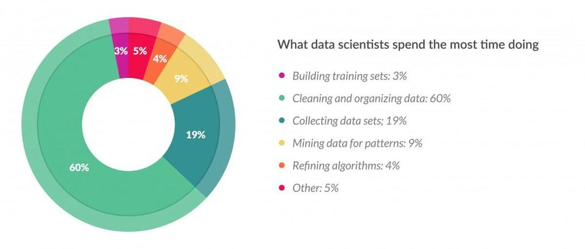
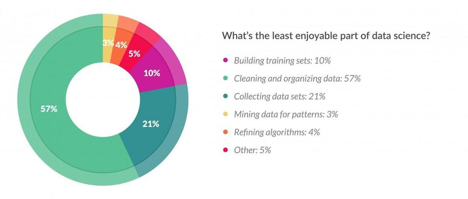

layout: true

```{r setup, include = F}
if (!require(easypackages)) install.packages("easypackages")
library(easypackages)

packages("knitr", "rmarkdown", "tidyverse", "kableExtra", "hadley/emo", prompt = F)

options(htmltools.dir.version = FALSE)

opts_chunk$set(echo = FALSE, fig.align = "center")

options(htmltools.dir.version = FALSE,
        htmltools.preserve.raw = FALSE)

opts_chunk$set(echo = TRUE,
               fig.align = "center")


xaringanExtra::use_xaringan_extra(c("tile_view", "clipboard"))
xaringanExtra::use_extra_styles(hover_code_line = TRUE,
                                mute_unhighlighted_code = FALSE)

```

<div class="my-footer">
  <div style="float: left;"><span>`r gsub("<br />", ", ", gsub("<br /><br />|<a.+$", "", metadata$author))`</span></div>
  <div style="float: right;"><span>`r metadata$location`, `r metadata$date`</span></div>
  <div style="text-align: center;"><span>`r gsub(".+<br />", " ", metadata$subtitle)`</span></div>
</div>

<style type="text/css">

pre {
  font-size: 10px
}
</style>

---

## Preprocessing

- Preprocessing refers to all steps that need to be taken to make the data suitable for the actual analysis

--

- For webscraping data, this is often more tedious and time-consuming than for survey data because:
  - the data are not designed with your analysis in mind
  - the data are typically less structured
  - the data are typically more complex
  - the data are typically more heterogenous
  - the data are typically larger
  
--
  
- *Note*: In addition, with large amounts of data it is often necessary to work on servers or clusters instead of regular desktop or laptop computers

  - Even then, restructuring or transforming data can take days, so mistakes hurt more

---

## Preprocessing

- In _Data Science_, most time is typically spent on the preprocessing rather than the actual analysis



.mini[Source: https://www.forbes.com/sites/gilpress/2016/03/23/data-preparation-most-time-consuming-least-enjoyable-data-science-task-survey-says/#157890a96f63]

---

## Preprocessing

- Also, it is perceived as the least enjoyable part of the process



.mini[Source: https://www.forbes.com/sites/gilpress/2016/03/23/data-preparation-most-time-consuming-least-enjoyable-data-science-task-survey-says/#157890a96f63]

---

## Preprocessing _YouTube_ comments


- The `tuber` package returns an `R` dataframe instead of a JSON

- We can select which data we need by using the API through `tuber`

- For single videos, the data are small enough to be processed on a regular desktop/laptop computer

- However, this doesn't mean that the data are already usable for all intents and purposes

- We still need to:
  - select
  - format
  - extract
  - link
  
the information that is relevant to us

---

## Preprocessing _YouTube_ Comments

For this session, we will use comments from the Emoji Movie Trailer <br>
(https://www.youtube.com/watch?v=r8pJt4dK_s4)


---

## Understanding Your Data (1)

The first step is always to explore your data. This is especially crucial for so-called _found data_ because they were not designed with your analysis in mind.

```{r, echo = TRUE}
# load raw data
comments <- readRDS("../../data/RawEmojiComments.rds")

# list all column names
colnames(comments)
```

Luckily, the _YouTube_ API is very [well documented](https://developers.google.com/youtube/v3/docs/comments) and provides brief explanations for all the variables you can extract from it

---

## Understanding Your Data (2)

This information is valuable for understanding what type of comments the dataframe contains

```{r, echo = TRUE}
table(is.na(comments$parentId))
```

A quick look at the documentation reveals:

**parentID**: _The unique ID of the parent comment. This property is only set if the comment was submitted as a reply to another comment._

---

## Understanding Your Data (3)

...or for knowing how specific data types are formatted

```{r, echo = TRUE}
head(comments$publishedAt)
class(comments$publishedAt)
```

A quick look at the documentation reveals:

**publishedAt**: _The date and time when the comment was originally published. The value is specified in ISO 8601 (YYYY-MM-DDThh:mm:ss.sZ) format._

---

## Understanding Your Data (4)

...or how similarly named variables differ from each other

```{r}
comments$textOriginal[6]
```

```{r results='hide'}
comments$textDisplay[6]

```

```{r, echo=FALSE}
unlist(strsplit(comments$textDisplay[6],"(?<=\\?)", perl=TRUE))

```

**textOriginal**: _The original, raw text of the comment as it was initially posted or last updated. The original text is only returned if it is accessible to the authenticated user, which is only guaranteed if the user is the comment's author._

**textDisplay**: _The comment's text. The text can be retrieved in either plain text or HTML. (The comments.list and commentThreads.list methods both support a textFormat parameter, which specifies the desired text format). Note that even the plain text may differ from the original comment text. For example, it may replace video links with video titles._

---

## Selecting What You (Don't) Need

Now we can decide on what we need for our analysis

```{r, echo = TRUE}
Selection <- subset(comments,select = -c(authorProfileImageUrl,
                                         authorChannelUrl,
                                         authorChannelId.value,
                                         videoId,
                                         canRate,
                                         viewerRating,
                                         moderationStatus))
colnames(Selection)

```

**Word of advice**: Always keep an unaltered copy of your raw data and don't overwrite it. You never know what kinds of mistakes/oversights you might notice down the line and you don't want to have to recollect everything. Save your parsed data in a separate file (or in multiple steps and versions if your preprocessing pipeline is complex).

---

## Formatting your Data

By default, the data you get out of `tuber` is most likely not in the right format for your analyses

```{r, echo = TRUE}
sapply(Selection, class)
```

```{r, echo = TRUE}
# summary statistics for like counts
summary(Selection$likeCount)
```

```{r, error = TRUE}
# time difference between first comment and now
Sys.time() - Selection$publishedAt[1]
```

---

## Formatting the `likeCount`

We want the `likeCount` to be a numeric variable and the timestamps to be datetime objects

```{r, echo = TRUE}
# transform likeCount to numeric
# (NB: this overwrites the original column)
Selection$likeCount <- as.numeric(Selection$likeCount)

# check
summary(Selection$likeCount)
```

We can now work with the number of likes as a numeric variable

---

## Formatting Timestamps (1)

Timestamps are extremely complex objects due to:
 - Different calendars
 - Different formattings
 - Different origins
 - Different time zones
 - Historical anomalies
 - Different resolutions
 - Summer vs. Wintertime (different for each country and depending on hemisphere!)
 - Leap years
 - [etc.](https://www.youtube.com/watch?v=-5wpm-gesOY)
 
For these reasons, you should **never** try to code your own time stamp translations from scratch. Fortunately, `R` has several build in methods for dealing with this madness. The most basic one is the `as.POSIXct()` function, the most convenient one is the `anytime()` function from the `anytime` package (another powerful option for dealing with times and dates in `R` is the [`lubridate` package](https://lubridate.tidyverse.org/) from the `Tidyverse`).

---

## Formatting Timestamps (2)

```{r, echo = TRUE}
# transform timestamps to datetime objects
Selection$publishedAt[1]
testtime <- as.POSIXct(Selection$publishedAt[1],
                       format = "%Y-%m-%dT%H:%M:%OSZ",
                       tz = "UTC")
testtime
```
```{r, echo = TRUE}
# test whether we can compute a difference
# with the datetime object
Sys.time() - testtime
```

This internal representation of time objects will be extremely important for plotting trends over time
and calculating time differences. You can find an overview of formatting date strings [here](https://rdrr.io/r/base/strptime.html).

---

## Formatting Timestamps (3)

A more convenient way of transforming datetime variables is the [`anytime` package](https://github.com/eddelbuettel/anytime). It automatically tries
to guess the format from the character string, so you don't have to. This is especially handy for vectors of datetimes in multiple formats.

```{r, echo = TRUE}
# transform datetimes using anytime()
library(anytime)
Selection$publishedAt <- anytime(Selection$publishedAt,
                                 asUTC = TRUE)
Selection$updatedAt <- anytime(Selection$updatedAt,
                               asUTC = TRUE)
sapply(list(Selection$publishedAt,Selection$updatedAt),class)
```

**Word of Advice**: For datetime conversions, always do some sanity checks, especially if you are using methods that automatically detect the format. Pay special attention to the _timezone_ in which your data are saved and compare it to the documentation of the standard.

---

## Formatting Timestamps (4)

Be aware of how to interpret your timestamps. Note that the date was interpreted as UTC but converted to our local CET timezone which is 1 hour ahead of UTC. This comment was made at 07:38:33 in _our timezone_, but we have no idea about the time at the location of the user.

```{r, echo = TRUE}
Selection$publishedAt[1]
```
 
---

## Extracting Information

After having formatted all our selected columns, we usually also want to create some new columns with information that is not directly available in the raw data. For example, consider these comments:

```{r, echo = TRUE}
# Example comments with extractable information
strwrap(Selection$textOriginal[37445],79)
Selection$textOriginal[26]
```
There are two issues exemplified by these comments:

1) Comments contain emojis and hyperlinks that might distort our text analysis later

2) These are features that we'd like to have in a separate column for our analysis

---

## Extracting Hyperlinks (1)

We will start with deleting hyperlinks from our text and saving them in an additional column. We will use the
text mining package [`qdapRegex`](https://github.com/trinker/qdapRegex) for this as it has predefined routines for handling large text vectors and [regular expressions](https://en.wikipedia.org/wiki/Regular_expression).

```{r, message=F, echo = TRUE}
# Note that we are using the original text so we don't have
# to deal with the HTML formatting of the links
library(qdapRegex)
Links <- rm_url(Selection$textOriginal, extract = TRUE)
LinkDel <- rm_url(Selection$textOriginal)
head(Links[!is.na(Links)],3)
```

---

## Extracting Hyperlinks (2)

We get back a list where each element corresponds to one row in the Selection dataframe and contains a vector of
links that were contained in the textOriginal column. At the same time, the link was removed from the Selection dataframe.

```{r, echo = TRUE}
strwrap(Selection$textOriginal[37445],79)
```

```{r, echo = TRUE}
LinkDel[37445]
Links[[37445]]
```

---

## Extracting Emojis (1)

The `qdapRegex` package has a lot of other different predefined functions for extracting or removing certain kinds of strings:
  - `rm_citation()`
  - `rm_date()`
  - `rm_phone()`
  - `rm_postal_code()`
  - `rm_email()`
  - `rm_dollar()`
  - `rm_emoticon()`
  
Unfortunately, it does **not** contain a predefined method for emojis, so we will have to use the `emo` package for removing the emojis and come up with our own method for extracting them.

---

## Extracting Emojis (2)

First we want to replace the emojis with a textual description, so that we can treat it just like any other token in text mining. This is no trivial task, as we have to go through each comment and replace each emoji with its respective textual description. Unfortunately, we did not find a working, easy-to-use out-of-the-box solution for this. But we can always make our own!

Essentially, we want to replace this:

```{r, echo = FALSE}
emo::ji("smile")
```

with this

```{r, echo = FALSE}
"EMOJI_GrinningFaceWithSmilingEyes"
```

---

## Extracting Emojis (3)

First of all, we need a dataframe that contains the emojis as they are internally represented by `R` (this means dealing with character encoding which can be quite the [hassle](https://dss.iq.harvard.edu/blog/escaping-character-encoding-hell-r-windows)). Luckily, this information is contained in the [`emo` package](https://github.com/hadley/emo).

```{r, warning=FALSE, echo = TRUE}
library(emo)
EmojiList <- jis
EmojiList[1:3,c(1,3,4)]
```

---

## Extracting Emojis (4)

Next, we need to paste the names of the emojis together while capitalizing the first letter of every word for better readability

```{r, echo = TRUE}
# Define a function for capitalizing and pasting names together
simpleCap <- function(x) {

  # Split the string
  splitted <- strsplit(x, " ")[[1]]

  # Paste it back together with capital letters
  paste(toupper(substring(splitted, 1,1)),
        substring(splitted, 2),
        sep = "",
        collapse = " ")
}
  
```

---

## Extracting Emojis (5)

```{r, echo = TRUE}
# Apply the function to all the names
CamelCaseEmojis <- lapply(jis$name, simpleCap)
CollapsedEmojis <- lapply(CamelCaseEmojis,
                          function(x){gsub(" ",
                                           "",
                                           x,
                                           fixed = TRUE)})
EmojiList[,4] <- unlist(CollapsedEmojis)
EmojiList[1:3,c(1,3,4)]
```


---

## Extracting Emojis (6)

After that, we need to order our dictionary from the longest to shortest string, so that we can prevent partial matching of shorter strings later.

.small[
```{r, echo = TRUE}
EmojiList <- EmojiList[rev(order(nchar(jis$emoji))),]
head(EmojiList[,c(1,3,4)],5)
```
]

Note that what we are ordering by the `emoji` column, not the `text` or `runes` columns.

---

## Extracting Emojis (7)

Now we can `loop` through all of our emojis and replace them consecutively in each comment (*note*: this may take a while)

```{r, warning = FALSE, echo = TRUE}

# Assign the column to a an object named TextEmoRep
TextEmoRep <- LinkDel

# Loop over all emojis for all comments in LinkDel
for (i in 1:dim(EmojiList)[1]) {

  TextEmoRep <- rm_default(TextEmoRep,
                  pattern = EmojiList[i,3],
                  replacement = paste0("EMOJI_",
                                       EmojiList[i,4],
                                       " "),
                  fixed = TRUE,
                  clean = FALSE,
                  trim = FALSE)
}

```

---

## Extracting Emojis (8)

As output, we get a large character vector with emojis replaced by textual descriptions.

```{r, echo = TRUE}
Selection$textOriginal[233]
```
```{r,results='hide'}
TextEmoRep[233]
```

```{r,  echo = FALSE}
unlist(strsplit(TextEmoRep[233],":",fixed=TRUE))
```

---

## Extracting Emojis Function

.ssmall[
```{r, echo = TRUE, size = 'tiny'}
ExtractEmoji <- function(x){

  SpacerInsert <- gsub(" ","[{[SpAC0R]}]", x)
  ExtractEmoji <- rm_between(SpacerInsert,
                             "EMOJI_","[{[SpAC0R]}]",
                             fixed = TRUE,
                             extract = TRUE,
                             clean = FALSE,
                             trim = FALSE,
                             include.markers = TRUE)
  
  UnlistEmoji <- unlist(ExtractEmoji)
  DeleteSpacer <- sapply(UnlistEmoji,
                         function(x){gsub("[{[SpAC0R]}]",
                                          " ",
                                          x,
                                          fixed = TRUE)})
  
  names(DeleteSpacer) <- NULL
  Emoji <- paste0(DeleteSpacer, collapse = "")
  return(Emoji)
}

```
]

---

## Extracting Emojis Function

We can apply the function to get one vector containing only the emojis as textual descriptions.

```{r, echo = TRUE}
Emoji <- sapply(TextEmoRep,ExtractEmoji)
names(Emoji) <- NULL
LinkDel[233]
Emoji[233]
```

---

## Removing Emojis

In addition, we remove the emojis from our `LinkDel` variable to have one _clean_ column that we can use for text mining later. This column will not contain hyperlinks or emojis.

```{r, echo = TRUE}
# We take the LinkDel column and also delete the emojis from it
library(emo)
LinkDel[233]
TextEmoDel <- ji_replace_all(LinkDel,"")
TextEmoDel[233]
```

---

## Summary: Extracting Information

We now have different versions of our text column

1) The original one, with hyperlinks and emojis (`Selection$textOriginal`)

2) One with only plain text and without hyperlinks and emojis (`TextEmoDel`)

3) One with only hyperlinks (`Links`)

4) One with only emojis (`Emoji`)

We want to integrate all of them into our dataframe.

---

## Linking Everything Back Together

We can now combine our dataframe with the additional columns we created to have the perfect starting point for our analysis! However, because we sometimes have more than two links or two emojis per comment, we need to use the `I()` function so we can put them in the dataframe `as is`. Later, we will have to unlist these columns rowwise if we want to use them. 

```{r, echo = TRUE}
df <- cbind.data.frame(Selection$authorDisplayName,
                       Selection$textOriginal,
                       TextEmoRep,
                       TextEmoDel,
                       Emoji = I(Emoji),
                       Selection$likeCount,
                       Links = I(Links),
                       Selection$publishedAt,
                       Selection$updatedAt,
                       Selection$parentId,
                       Selection$id,
                       stringsAsFactors = FALSE)
```

---

## Linking Everything Back Together

As a final step, we can give the columns appropriate names and save the dataframe for later use

```{r, echo = TRUE}

# set column names
names(df) <- c("Author",
               "Text",
               "TextEmojiReplaced",
               "TextEmojiDeleted",
               "Emoji",
               "LikeCount",
               "URL",
               "Published",
               "Updated",
               "ParentId",
               "CommentID")

saveRDS(df, file = "../../data/ParsedEmojiComments.rds")

```

---

class: center, middle

# [Exercise](https://jobreu.github.io/youtube-workshop-gesis-2022/exercises/A4_Preprocessing_and_cleaning_data_exercises_question.html) time `r ji("weight_lifting_woman")``r ji("muscle")``r ji("running_man")``r ji("biking_man")`

## [Solutions](https://jobreu.github.io/youtube-workshop-gesis-2022/solutions/A4_Preprocessing_and_cleaning_data_exercises_solution.html)